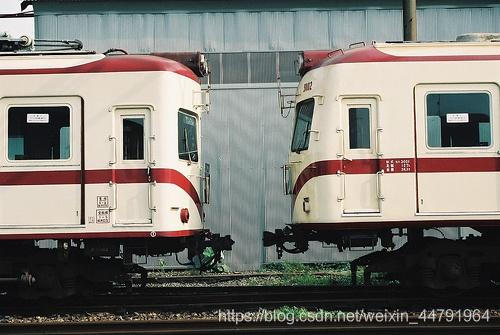
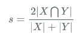

# 什么是DeeplabV3+模型

DeeplabV3+被认为是语义分割的新高峰，因为这个模型的效果非常好。
 DeeplabV3+主要在模型的架构上作文章，引入了可任意控制编码器提取特征的分辨率，通过空洞卷积平衡精度和耗时。


DeeplabV3+在Encoder部分**引入了大量的空洞卷积，在不损失信息的情况下，加大了感受野，让每个卷积输出都包含较大范围的信息**。如下就是空洞卷积的一个示意图，所谓空洞就是特征点提取的时候**会跨像素**。


# 代码下载

Github源码下载地址为： 

https://github.com/bubbliiiing/deeplabv3-plus-pytorch

# DeeplabV3+实现思路

## 一、预测部分

### 1、主干网络介绍


DeeplabV3+在**论文中采用的是Xception系列作为主干特征提取网络**，本博客会给大家提供两个主干网络，分别是Xception和mobilenetv2。

但是由于算力限制（我没有什么卡），为了方便博客的进行，本文以mobilenetv2为例，给大家进行解析。

MobileNet模型是Google针对手机等嵌入式设备提出的一种轻量级的深层神经网络。

MobileNetV2是MobileNet的升级版，它具有一个非常重要的特点就是使用了Inverted resblock，整个mobilenetv2都由Inverted resblock组成。

Inverted resblock可以分为两个部分：

左边是主干部分，**首先利用1x1卷积进行升维，然后利用3x3深度可分离卷积进行特征提取，然后再利用1x1卷积降维**。

右边是残差边部分，**输入和输出直接相接**。


需要注意的是，**在DeeplabV3当中，一般不会5次下采样，可选的有3次下采样和4次下采样，本文使用的4次下采样**。**这里所提到的下采样指的是不会进行五次长和宽的压缩，通常选用三次或者四次长和宽的压缩。**


在完成MobilenetV2的后，**我们可以获得两个有效特征层，一个有效特征层是输入图片高和宽压缩两次的结果，一个有效特征层是输入图片高和宽压缩四次的结果。**

> nets/mobilenetv2.py

```python
import math
import os

import torch
import torch.nn as nn
import torch.utils.model_zoo as model_zoo

BatchNorm2d = nn.BatchNorm2d

# 卷积,标准化,激活函数
def conv_bn(inp, oup, stride):
    return nn.Sequential(
        nn.Conv2d(inp, oup, 3, stride, 1, bias=False),
        BatchNorm2d(oup),
        nn.ReLU6(inplace=True)
    )

# 1x1卷积,表转化,激活函数
def conv_1x1_bn(inp, oup):
    return nn.Sequential(
        nn.Conv2d(inp, oup, 1, 1, 0, bias=False),
        BatchNorm2d(oup),
        nn.ReLU6(inplace=True)
    )

class InvertedResidual(nn.Module):
    def __init__(self, inp, oup, stride, expand_ratio):
        super().__init__()
        self.stride = stride
        assert stride in [1, 2]

        hidden_dim = round(inp * expand_ratio)
        # 步长为1同时通道不变化才相加
        self.use_res_connect = self.stride == 1 and inp == oup
        #----------------------------------------------------#
        #   利用1x1卷积根据输入进来的通道数进行通道数上升,不扩张就不需要第一个1x1卷积了
        #----------------------------------------------------#
        if expand_ratio == 1:
            self.conv = nn.Sequential(
                #--------------------------------------------#
                #   进行3x3的逐层卷积，进行跨特征点的特征提取
                #--------------------------------------------#
                nn.Conv2d(hidden_dim, hidden_dim, 3, stride, 1, groups=hidden_dim, bias=False),
                BatchNorm2d(hidden_dim),
                nn.ReLU6(inplace=True),
                #-----------------------------------#
                #   利用1x1卷积进行通道数的调整
                #-----------------------------------#
                nn.Conv2d(hidden_dim, oup, 1, 1, 0, bias=False),
                BatchNorm2d(oup),
            )
        else:
            self.conv = nn.Sequential(
                #-----------------------------------#
                #   利用1x1卷积进行通道数的上升
                #-----------------------------------#
                nn.Conv2d(inp, hidden_dim, 1, 1, 0, bias=False),
                BatchNorm2d(hidden_dim),
                nn.ReLU6(inplace=True),
                #--------------------------------------------#
                #   进行3x3的逐层卷积，进行跨特征点的特征提取
                #--------------------------------------------#
                nn.Conv2d(hidden_dim, hidden_dim, 3, stride, 1, groups=hidden_dim, bias=False),
                BatchNorm2d(hidden_dim),
                nn.ReLU6(inplace=True),
                #-----------------------------------#
                #   利用1x1卷积进行通道数的下降
                #-----------------------------------#
                nn.Conv2d(hidden_dim, oup, 1, 1, 0, bias=False),
                BatchNorm2d(oup),
            )

    def forward(self, x):
        if self.use_res_connect:
            return x + self.conv(x)
        else:
            return self.conv(x)

class MobileNetV2(nn.Module):
    def __init__(self, n_class=1000, input_size=224, width_mult=1.):
        super().__init__()
        block = InvertedResidual
        input_channel = 32
        last_channel = 1280
        interverted_residual_setting = [
            # 扩张,out_channel,重复次数,stride
            # t, c, n, s
            [1, 16, 1, 1], # [256, 256, 32] -> [256, 256, 16]
            [6, 24, 2, 2], # [256, 256, 16] -> [128, 128, 24]   开始id:2     <浅层特征输出>
            [6, 32, 3, 2], # [128, 128, 24] -> [64, 64, 32]     开始id:4

            # 后面两层的膨胀系数会根据downsample_factor调整, 为8这里为2
            [6, 64, 4, 2], # [64, 64, 32] -> [32, 32, 64]       开始id:7     stride会根据downsample_factor调整, 为16这里为2, 为8这里为1
            [6, 96, 3, 1], # [32, 32, 64] -> [32, 32, 96]

            # 后面两层的膨胀系数会根据downsample_factor调整, 为16这里为2, 为8这里为4
            [6, 160, 3, 2], # [32, 32, 96 ] -> [16, 16, 160]    开始id:14    stride会变为1,保持高宽不变
            [6, 320, 1, 1], # [16, 16, 160] -> [16, 16, 320]                 <深层特征输出>
        ]

        assert input_size % 32 == 0
        input_channel = int(input_channel * width_mult)
        self.last_channel = int(last_channel * width_mult) if width_mult > 1.0 else last_channel
        # 第1层卷积 512, 512, 3 -> 256, 256, 32
        self.features = [conv_bn(3, input_channel, 2)]

        # 根据上述列表进行循环，构建mobilenetv2的结构
        for t, c, n, s in interverted_residual_setting:
            output_channel = int(c * width_mult)
            for i in range(n):
                if i == 0:
                    self.features.append(block(input_channel, output_channel, s, expand_ratio=t))
                else:
                    self.features.append(block(input_channel, output_channel, 1, expand_ratio=t))
                input_channel = output_channel

        # mobilenetv2结构的收尾工作,最后1层卷积
        self.features.append(conv_1x1_bn(input_channel, self.last_channel))
        self.features = nn.Sequential(*self.features)

        # 分类
        self.classifier = nn.Sequential(
            nn.Dropout(0.2),
            nn.Linear(self.last_channel, n_class),
        )

        self._initialize_weights()

    def forward(self, x):
        x = self.features(x)
        x = x.mean(3).mean(2)
        x = self.classifier(x)
        return x

    def _initialize_weights(self):
        for m in self.modules():
            if isinstance(m, nn.Conv2d):
                n = m.kernel_size[0] * m.kernel_size[1] * m.out_channels
                m.weight.data.normal_(0, math.sqrt(2. / n))
                if m.bias is not None:
                    m.bias.data.zero_()
            elif isinstance(m, BatchNorm2d):
                m.weight.data.fill_(1)
                m.bias.data.zero_()
            elif isinstance(m, nn.Linear):
                n = m.weight.size(1)
                m.weight.data.normal_(0, 0.01)
                m.bias.data.zero_()


def load_url(url, model_dir='./model_data', map_location=None):
    if not os.path.exists(model_dir):
        os.makedirs(model_dir)
    filename = url.split('/')[-1]
    cached_file = os.path.join(model_dir, filename)
    if os.path.exists(cached_file):
        return torch.load(cached_file, map_location=map_location)
    else:
        return model_zoo.load_url(url,model_dir=model_dir)

def mobilenetv2(pretrained=False, **kwargs):
    model = MobileNetV2(n_class=1000, **kwargs)
    if pretrained:
        model.load_state_dict(load_url('https://github.com/bubbliiiing/deeplabv3-plus-pytorch/releases/download/v1.0/mobilenet_v2.pth.tar'), strict=False)
    return model

if __name__ == "__main__":
    model = mobilenetv2()
    for i, layer in enumerate(model.features):
        print(i, layer)
```

### 2、加强特征提取结构


在DeeplabV3+中，加强特征提取网络可以分为两部分：

**在Encoder中，我们会对压缩四次的初步有效特征层利用并行的Atrous Convolution，分别用不同rate的Atrous Convolution进行特征提取，再进行合并，再进行1x1卷积压缩特征。**


 **在Decoder中，我们会对压缩两次的初步有效特征层利用1x1卷积调整通道数，再和空洞卷积后的有效特征层上采样的结果进行堆叠，在完成堆叠后，进行两次深度可分离卷积块。**


这个时候，我们就获得了一个最终的有效特征层，它是整张图片的特征浓缩。

> nets/deeplabv3_plus.py

```python
import torch
import torch.nn as nn
import torch.nn.functional as F
from nets.xception import xception
from nets.mobilenetv2 import mobilenetv2

class MobileNetV2(nn.Module):
    def __init__(self, downsample_factor=8, pretrained=True):
        super(MobileNetV2, self).__init__()
        from functools import partial

        model           = mobilenetv2(pretrained)
        self.features   = model.features[:-1] # 不要features层最后的1x1Conv

        self.total_idx  = len(self.features) # 18层
        self.down_idx   = [2, 4, 7, 14]   # 下采样层的id开始序号

        #--------------------------------------------------------------------------------------------#
        #   根据下采样因子修改卷积的步长与膨胀系数
        #
        #--------------------------------------------------------------------------------------------#
        if downsample_factor == 8:
            # 3次下采样,后面的stride都改为1
            # 将mobilenetv2后三四层卷积的膨胀系数设为2
            for i in range(self.down_idx[-2], self.down_idx[-1]):
                self.features[i].apply(
                    partial(self._nostride_dilate, dilate=2)
                )
            # 将mobilenetv2后两层卷积的膨胀系数设为4
            for i in range(self.down_idx[-1], self.total_idx):
                self.features[i].apply(
                    partial(self._nostride_dilate, dilate=4)
                )
        elif downsample_factor == 16:
            # 4次下采样,最后一次stride改为1
            # 将mobilenetv2后两层卷积的膨胀系数设为2
            for i in range(self.down_idx[-1], self.total_idx):
                self.features[i].apply(
                    partial(self._nostride_dilate, dilate=2)
                )

    def _nostride_dilate(self, m, dilate):
        classname = m.__class__.__name__
        # 修改卷积层
        if classname.find('Conv') != -1:
            # 将深层的步长由2改为1,减少一层下采样
            if m.stride == (2, 2):
                m.stride = (1, 1)
                if m.kernel_size == (3, 3):
                    m.dilation = (dilate//2, dilate//2)     # 2/2=1 不进行扩张卷积
                    m.padding = (dilate//2, dilate//2)
            else:
                if m.kernel_size == (3, 3):
                    m.dilation = (dilate, dilate)
                    m.padding = (dilate, dilate)

    def forward(self, x):
        # 浅层和深层
        low_level_features = self.features[:4](x)   # 宽高变为四分之一
        x = self.features[4:](low_level_features)   # 宽高再变为四分之一
        return low_level_features, x


#-----------------------------------------#
#   ASPP特征提取模块
#   利用不同膨胀率的膨胀卷积进行特征提取
#   注意padding和dilation都要设置
#-----------------------------------------#
class ASPP(nn.Module):
    def __init__(self, dim_in, dim_out, rate=1, bn_mom=0.1):
        super(ASPP, self).__init__()
        self.branch1 = nn.Sequential(
            nn.Conv2d(dim_in, dim_out, 1, 1, padding=0, dilation=rate,bias=True),   # 有了bn,bias应该设置为False
            nn.BatchNorm2d(dim_out, momentum=bn_mom),
            nn.ReLU(inplace=True),
        )
        self.branch2 = nn.Sequential(
            nn.Conv2d(dim_in, dim_out, 3, 1, padding=6*rate, dilation=6*rate, bias=True),
            nn.BatchNorm2d(dim_out, momentum=bn_mom),
            nn.ReLU(inplace=True),
        )
        self.branch3 = nn.Sequential(
            nn.Conv2d(dim_in, dim_out, 3, 1, padding=12*rate, dilation=12*rate, bias=True),
            nn.BatchNorm2d(dim_out, momentum=bn_mom),
            nn.ReLU(inplace=True),
        )
        self.branch4 = nn.Sequential(
            nn.Conv2d(dim_in, dim_out, 3, 1, padding=18*rate, dilation=18*rate, bias=True),
            nn.BatchNorm2d(dim_out, momentum=bn_mom),
            nn.ReLU(inplace=True),
        )
        self.branch5_conv = nn.Conv2d(dim_in, dim_out, 1, 1, 0,bias=True)
        self.branch5_bn = nn.BatchNorm2d(dim_out, momentum=bn_mom)
        self.branch5_relu = nn.ReLU(inplace=True)

        # 拼接后调整维度
        self.conv_cat = nn.Sequential(
            nn.Conv2d(dim_out*5, dim_out, 1, 1, padding=0,bias=True),
            nn.BatchNorm2d(dim_out, momentum=bn_mom),
            nn.ReLU(inplace=True),
        )

    def forward(self, x):
        b, c, h, w = x.size()
        #-----------------------------------------#
        #   一共五个分支
        #-----------------------------------------#
        conv1x1 = self.branch1(x)
        conv3x3_1 = self.branch2(x)
        conv3x3_2 = self.branch3(x)
        conv3x3_3 = self.branch4(x)
        #-----------------------------------------#
        #   第五个分支，全局平均池化+卷积
        #-----------------------------------------#
        # global_feature = torch.mean(x, 2, keepdim=True)
        # global_feature = torch.mean(global_feature, 3, keepdim=True)
        global_feature = x.mean((2,3), keepdim=True)      # 这一行这下一行是简化写法
        # global_feature = F.adaptive_avg_pool2d(x, output_size=(1,1))
        global_feature = self.branch5_conv(global_feature)
        global_feature = self.branch5_bn(global_feature)
        global_feature = self.branch5_relu(global_feature)
        global_feature = F.interpolate(global_feature, (h, w), None, 'bilinear', True)
        #-----------------------------------------#
        #   将五个分支的内容堆叠起来
        #   然后1x1卷积整合特征。
        #-----------------------------------------#
        feature_cat = torch.cat([conv1x1, conv3x3_1, conv3x3_2, conv3x3_3, global_feature], dim=1)
        result = self.conv_cat(feature_cat)
        return result

class DeepLab(nn.Module):
    def __init__(self, num_classes, backbone="mobilenet", pretrained=True, downsample_factor=16):
        super(DeepLab, self).__init__()
        if backbone=="xception":
            #----------------------------------#
            #   获得两个特征层
            #   浅层特征    [128,128,256]
            #   主干部分    [30,30,2048]
            #----------------------------------#
            self.backbone = xception(downsample_factor=downsample_factor, pretrained=pretrained)
            in_channels = 2048
            low_level_channels = 256
        elif backbone=="mobilenet":
            #----------------------------------#
            #   获得两个特征层
            #   浅层特征    [128,128,24]
            #   主干部分    [30,30,320]
            #----------------------------------#
            self.backbone = MobileNetV2(downsample_factor=downsample_factor, pretrained=pretrained)
            in_channels = 320
            low_level_channels = 24
        else:
            raise ValueError('Unsupported backbone - `{}`, Use mobilenet, xception.'.format(backbone))

        #-----------------------------------------#
        #   ASPP特征提取模块
        #   利用不同膨胀率的膨胀卷积进行特征提取,获取深层特征
        #-----------------------------------------#         16/2
        self.aspp = ASPP(dim_in=in_channels, dim_out=256, rate=16//downsample_factor)

        #----------------------------------#
        #   浅层特征边维度变化 1层1x1Conv
        #----------------------------------#
        self.shortcut_conv = nn.Sequential(
            nn.Conv2d(low_level_channels, 48, 1),
            nn.BatchNorm2d(48),
            nn.ReLU(inplace=True)
        )

        #-----------------------------------------#
        #   拼接后的特征提取 2层3x3Conv
        #-----------------------------------------#
        self.cat_conv = nn.Sequential(
            # 48+256 是深浅堆叠厚度
            nn.Conv2d(48+256, 256, 3, stride=1, padding=1),
            nn.BatchNorm2d(256),
            nn.ReLU(inplace=True),
            nn.Dropout(0.5),

            nn.Conv2d(256, 256, 3, stride=1, padding=1),
            nn.BatchNorm2d(256),
            nn.ReLU(inplace=True),
            nn.Dropout(0.1),
        )
        # 对所有点分类
        self.cls_conv = nn.Conv2d(256, num_classes, 1, stride=1)

    def forward(self, x):
        H, W = x.size(2), x.size(3)
        #-----------------------------------------#
        #   获得两个特征层
        #   low_level_features: 浅层特征-进行卷积处理
        #   x : 主干部分-利用ASPP结构进行加强特征提取
        #-----------------------------------------#
        low_level_features, x = self.backbone(x)
        x = self.aspp(x)
        low_level_features = self.shortcut_conv(low_level_features)

        #-----------------------------------------#
        #   将加强特征边上采样
        #   与浅层特征堆叠后利用卷积进行特征提取
        #-----------------------------------------#
        x = F.interpolate(x, size=(low_level_features.size(2), low_level_features.size(3)), mode='bilinear', align_corners=True)
        x = self.cat_conv(torch.cat((x, low_level_features), dim=1))
        x = self.cls_conv(x)
        # 还原为原图大小
        x = F.interpolate(x, size=(H, W), mode='bilinear', align_corners=True)
        return x
```

### 3、利用特征获得预测结果

利用1、2步，我们可以获取输入进来的图片的特征，此时，我们需要利用特征获得预测结果。

利用特征获得预测结果的过程可以分为2步：

1. **利用一个1x1卷积进行通道调整，调整成Num_Classes。**
2. **利用resize进行上采样使得最终输出层，宽高和输入图片一样。**


> nets/deeplabv3_plus.py

```PYTHON
class DeepLab(nn.Module):
    def __init__(self, num_classes, backbone="mobilenet", pretrained=True, downsample_factor=16):
        super(DeepLab, self).__init__()
        if backbone=="xception":
            #----------------------------------#
            #   获得两个特征层
            #   浅层特征    [128,128,256]
            #   主干部分    [30,30,2048]
            #----------------------------------#
            self.backbone = xception(downsample_factor=downsample_factor, pretrained=pretrained)
            in_channels = 2048
            low_level_channels = 256
        elif backbone=="mobilenet":
            #----------------------------------#
            #   获得两个特征层
            #   浅层特征    [128,128,24]
            #   主干部分    [30,30,320]
            #----------------------------------#
            self.backbone = MobileNetV2(downsample_factor=downsample_factor, pretrained=pretrained)
            in_channels = 320
            low_level_channels = 24
        else:
            raise ValueError('Unsupported backbone - `{}`, Use mobilenet, xception.'.format(backbone))

        #-----------------------------------------#
        #   ASPP特征提取模块
        #   利用不同膨胀率的膨胀卷积进行特征提取,获取深层特征
        #-----------------------------------------#         16/2
        self.aspp = ASPP(dim_in=in_channels, dim_out=256, rate=16//downsample_factor)

        #----------------------------------#
        #   浅层特征边维度变化 1层1x1Conv
        #----------------------------------#
        self.shortcut_conv = nn.Sequential(
            nn.Conv2d(low_level_channels, 48, 1),
            nn.BatchNorm2d(48),
            nn.ReLU(inplace=True)
        )

        #-----------------------------------------#
        #   拼接后的特征提取 2层3x3Conv
        #-----------------------------------------#
        self.cat_conv = nn.Sequential(
            # 48+256 是深浅堆叠厚度
            nn.Conv2d(48+256, 256, 3, stride=1, padding=1),
            nn.BatchNorm2d(256),
            nn.ReLU(inplace=True),
            nn.Dropout(0.5),

            nn.Conv2d(256, 256, 3, stride=1, padding=1),
            nn.BatchNorm2d(256),
            nn.ReLU(inplace=True),
            nn.Dropout(0.1),
        )
        # 对所有点分类
        self.cls_conv = nn.Conv2d(256, num_classes, 1, stride=1)

    def forward(self, x):
        H, W = x.size(2), x.size(3)
        #-----------------------------------------#
        #   获得两个特征层
        #   low_level_features: 浅层特征-进行卷积处理
        #   x : 主干部分-利用ASPP结构进行加强特征提取
        #-----------------------------------------#
        low_level_features, x = self.backbone(x)
        x = self.aspp(x)
        low_level_features = self.shortcut_conv(low_level_features)

        #-----------------------------------------#
        #   将加强特征边上采样
        #   与浅层特征堆叠后利用卷积进行特征提取
        #-----------------------------------------#
        x = F.interpolate(x, size=(low_level_features.size(2), low_level_features.size(3)), mode='bilinear', align_corners=True)
        x = self.cat_conv(torch.cat((x, low_level_features), dim=1))
        x = self.cls_conv(x)
        # 还原为原图大小
        x = F.interpolate(x, size=(H, W), mode='bilinear', align_corners=True)
        return x
```

## 二、训练部分

### 1、训练文件详解

我们使用的训练文件采用VOC的格式。
语义分割模型训练的文件分为两部分。
第一部分是原图，像这样：



第二部分标签，像这样：


原图就是普通的RGB图像，标签就是灰度图或者8位彩色图。

**原图的shape为[height, width, 3]，标签的shape就是[height, width]，对于标签而言，每个像素点的内容是一个数字，比如0、1、2、3、4、5……，代表这个像素点所属的类别。**

语义分割的工作就是对原始的图片的每一个像素点进行分类，**所以通过预测结果中每个像素点属于每个类别的概率与标签对比，可以对网络进行训练。**

### 2、LOSS解析

本文所使用的LOSS由两部分组成：

1. **Cross Entropy Loss。**
2. **Dice Loss。**

**Cross Entropy Loss就是普通的交叉熵损失，当语义分割平台利用Softmax对像素点进行分类的时候，进行使用。**

Dice loss将语义分割的评价指标作为Loss，**Dice系数是一种集合相似度度量函数，通常用于计算两个样本的相似度，取值范围在[0,1]。**

计算公式如下：



就是**预测结果和真实结果的交乘上2**，除上**预测结果加上真实结果**。其值在0-1之间。越大表示预测结果和真实结果重合度越大。**所以Dice系数是越大越好。**

如果作为LOSS的话是越小越好，所以使得Dice loss = 1 - Dice，就可以将Loss作为语义分割的损失了。

> nets/deeplabv3_training.py

```python
import torch
import torch.nn as nn
import torch.nn.functional as F
from torch import nn

def CE_Loss(inputs, target, cls_weights, num_classes=21):
    n, c, h, w = inputs.size()
    nt, ht, wt = target.size()
    if h != ht and w != wt:
        inputs = F.interpolate(inputs, size=(ht, wt), mode="bilinear", align_corners=True)

    temp_inputs = inputs.transpose(1, 2).transpose(2, 3).contiguous().view(-1, c)
    temp_target = target.view(-1)

    CE_loss  = nn.CrossEntropyLoss(weight=cls_weights, ignore_index=num_classes)(temp_inputs, temp_target)
    return CE_loss

def Focal_Loss(inputs, target, cls_weights, num_classes=21, alpha=0.5, gamma=2):
    n, c, h, w = inputs.size()
    nt, ht, wt = target.size()
    if h != ht and w != wt:
        inputs = F.interpolate(inputs, size=(ht, wt), mode="bilinear", align_corners=True)

    temp_inputs = inputs.transpose(1, 2).transpose(2, 3).contiguous().view(-1, c)
    temp_target = target.view(-1)

    logpt  = -nn.CrossEntropyLoss(weight=cls_weights, ignore_index=num_classes, reduction='none')(temp_inputs, temp_target)
    pt = torch.exp(logpt)
    if alpha is not None:
        logpt *= alpha
    loss = -((1 - pt) ** gamma) * logpt
    loss = loss.mean()
    return loss

def Dice_loss(inputs, target, beta=1, smooth = 1e-5):
    n, c, h, w = inputs.size()
    nt, ht, wt, ct = target.size()
    if h != ht and w != wt:
        inputs = F.interpolate(inputs, size=(ht, wt), mode="bilinear", align_corners=True)

    temp_inputs = torch.softmax(inputs.transpose(1, 2).transpose(2, 3).contiguous().view(n, -1, c),-1)
    temp_target = target.view(n, -1, ct)

    #--------------------------------------------#
    #   计算dice loss
    #--------------------------------------------#
    tp = torch.sum(temp_target[...,:-1] * temp_inputs, axis=[0,1])
    fp = torch.sum(temp_inputs                       , axis=[0,1]) - tp
    fn = torch.sum(temp_target[...,:-1]              , axis=[0,1]) - tp

    score = ((1 + beta ** 2) * tp + smooth) / ((1 + beta ** 2) * tp + beta ** 2 * fn + fp + smooth)
    dice_loss = 1 - torch.mean(score)
    return dice_loss
```

